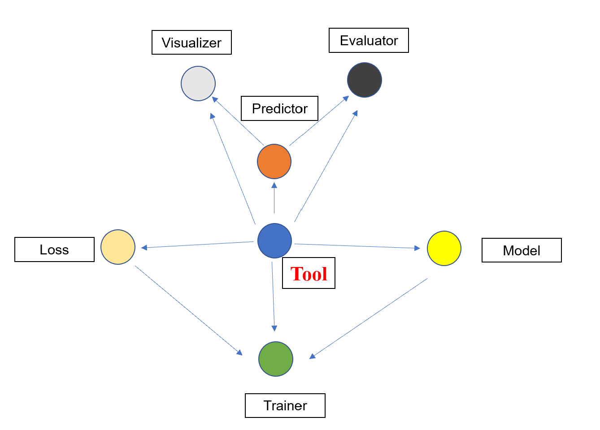

# ObjectDetection
This packet is a framework used for developing object detection.

diyage_ObjectDetection contains 7 parts.  
1. Tool(s) --> the most important one. It provides almost all 
functions/methods for your programming.  
Used: You need inherit from Tool/BaseTools/tools/BaseTools, 
and overwrite abstract methods (make_target, split_target, 
split_predict, get_grid_number_and_pre_anchor_w_h)  

2. Predictor --> very important one. You could decode the 
output of model using it(from tensor(s) to bbox(es) of other useful info(s)).  
Used: You need inherit from Tool/BaseTools/predictor/BasePredictor, 
and overwrite abstract methods (change_image_wh, decode_one_target, 
decode_target, decode_one_predict, decode_predict)  

3. Visualizer --> Used for Visualization.
4. Evaluator --> Used for Evaluating.
5. Loss --> Used for computing loss.
6. Model --> Used for building network structure.
7. Trainer --> Used for training Model.

Please see files under 'Tool/BaseTools/', you will get more detail information in each file.

